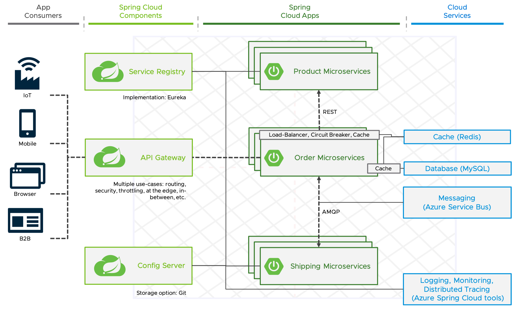

# Demo for a typical Spring Cloud Architecture on Azure Spring Cloud

**See repository [here](https://github.com/tsalm-pivotal/spring-cloud-demo) for the same application deployed on TAS/PCF/CF**
**See repository [here](https://github.com/tsalm-pivotal/spring-cloud-demo-k8s) for the same application deployed on Kubernetes**



## Deployment

Information on how to set up the Azure CLI is available [here](https://docs.microsoft.com/en-us/learn/modules/azure-spring-cloud-workshop/2-create-instance)

1. Create an Azure Spring Cloud instance and set it as target
    ```bash
    RESOURCE_GROUP_NAME=asc-sc-demo-resource-group
    SPRING_CLOUD_NAME=sc-demo # Must be unique among all ASC instances across all of Azure
    az group create -g "$RESOURCE_GROUP_NAME" -l westeurope
    az spring-cloud create -g "$RESOURCE_GROUP_NAME" -n "$SPRING_CLOUD_NAME" --sku standard
    az configure --defaults group=${RESOURCE_GROUP_NAME}
    az configure --defaults spring-cloud=${SPRING_CLOUD_NAME}
    ```
2. Configure Spring Cloud Config Server Git repository
    ```
    az spring-cloud config-server git set --uri https://github.com/tsalm-pivotal/spring-cloud-demo-asc --label master --search-paths config-server-configuration --name ${SPRING_CLOUD_NAME}
    ```
3. Create services
    ```
    az mysql server create -n ${SPRING_CLOUD_NAME}-mysql-server -l westeurope --sku-name B_Gen5_1 -u sc-user -p SpringCloud20!
    az mysql db create -s ${SPRING_CLOUD_NAME}-mysql-server -n order-db
    az mysql server firewall-rule create -n AllowAllWindowsAzureIps -s ${SPRING_CLOUD_NAME}-mysql-server --start-ip-address 0.0.0.0 --end-ip-address 0.0.0.0
    MYSQL_SERVER_RESOURCE_ID="$(az mysql server show -n ${SPRING_CLOUD_NAME}-mysql-server | grep '\"id\":'| sed 's/.*\"id\": \"//' | sed 's/\",//')"
    az redis create -n ${SPRING_CLOUD_NAME}-redis -l westeurope --sku Basic --vm-size c0
    REDIS_RESOURCE_ID="$(az redis show -n ${SPRING_CLOUD_NAME}-redis | grep '\"id\":'| sed 's/.*\"id\": \"//' | sed 's/\",//')"
    az servicebus namespace create -n ${SPRING_CLOUD_NAME}-bus-ns
    az servicebus queue create -n order-shipping-queue --namespace-name ${SPRING_CLOUD_NAME}-bus-ns
    az servicebus queue create -n order-delivered-queue --namespace-name ${SPRING_CLOUD_NAME}-bus-ns
    ```
    Get the connection string and add it as configuration property `spring.cloud.azure.servicebus.connection-string` to 
    the sc-order-service and `spring.cloud.azure.servicebus.connection-string` sc-shipping-service (configuration server 
    repository or local):
    ```
    az servicebus namespace authorization-rule keys list --namespace-name ${SPRING_CLOUD_NAME}-bus-ns --name RootManageSharedAccessKey --query primaryConnectionString --output tsv    
    ```
4. Create an application scaffold
    ```
    az spring-cloud app create -n sc-order-service
    az spring-cloud app create -n sc-shipping-service
    az spring-cloud app create -n sc-product-service
    az spring-cloud app create -n sc-gateway --is-public true
    ```
5. Bind the services to the microservices
    ```
    az spring-cloud app binding mysql add --app sc-order-service --database-name order-db -n sc-order-service-mysql --resource-id $MYSQL_SERVER_RESOURCE_ID --username 'sc-user@'${SPRING_CLOUD_NAME}'-mysql-server' --key SpringCloud20!
    az spring-cloud app binding redis add --app sc-order-service -n sc-order-service-redis --resource-id $REDIS_RESOURCE_ID
    ```
6. Deploy the microservice
    ```
    az spring-cloud app deploy -n sc-order-service --target-module order-service --runtime-version Java_11
    az spring-cloud app deploy -n sc-product-service --target-module product-service --runtime-version Java_11
    az spring-cloud app deploy -n sc-shipping-service --target-module shipping-service --runtime-version Java_11
    az spring-cloud app deploy -n sc-gateway --target-module gateway --runtime-version Java_11
    ```

## API usage 

Go to Apps in your ASC instance Azure portal and select sc-gateway to have the url.
 
- Fetch products:
	```
	curl https://XXXXXXXX-gateway.azuremicroservices.io/SC-PRODUCT-SERVICE/api/v1/products
	```
- Fetch orders:
	```
	curl https://XXXXXXXX-gateway.azuremicroservices.io/SC-ORDER-SERVICE/api/v1/orders
	```
- Create order (After 10 seconds the status of the order should be DELIVERED)
	```
	curl --header "Content-Type: application/json" --request POST \
	  --data '{"productId":1,"shippingAddress":"Test address"}' \
	  https://XXXXXXXX-gateway.azuremicroservices.io/SC-ORDER-SERVICE/api/v1/orders
	```
 
